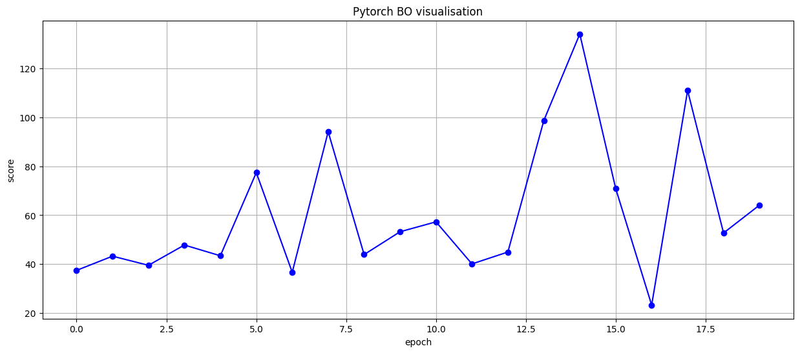
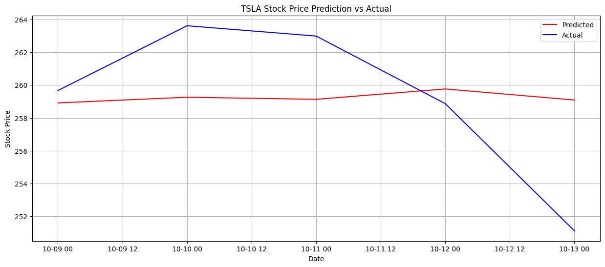
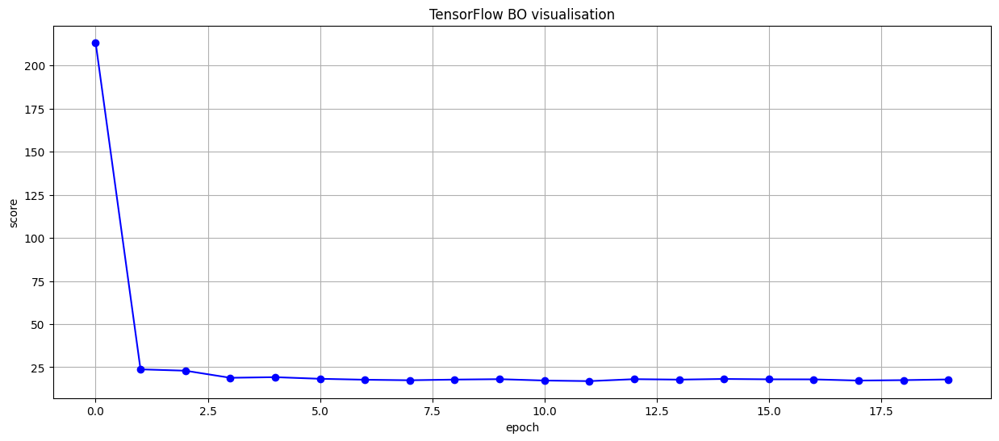
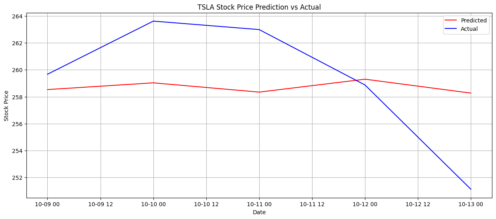

# final-capstone-repo & additional side-projects
Final capstone project for Professional Certificate in Machine Learning and Artificial Intelligence

After completing the Professional Certificate provided by Imperial College, projects with similar objectives were trialed and tested with the assistance of Luke Hardy (https://luke-hardy.medium.com/). These projects include unsupervised learning (k-means clustering) to identify potential stocks suitable for short-term investment, and Twitter sentiment analysis to identify current 'hot stocks' to capitalize on their momentum.

# Algorithmic Trading

## NON-TECHNICAL EXPLANATION OF YOUR PROJECT
The objective of this project is to mirror the achievements of The Medallion Fund, a hedge fund under the management of Renaissance Technologies. Our primary focus is on identifying trade signals within the equity sector. The project's goal is to uncover predictive signals that can initiate trades. While there are no artificial intelligence systems capable of predicting future events, price discrepancies present us with an opportunity to profit from short-term price movements.

## DATA
This project will download market data from yahoo! finance (yfinance). This is a open souce library developed by Ran Aroussi which offers a threaded and Pythonic way to download market data from Yahoo!Finance. 
https://pypi.org/project/yfinance/

## MODEL 
This project will utilize Recurrent Neural Network (RNNs) to predict the future from sequence of variable lengths. Due to the vanishing/exploding gradient problem from unrolling a large number of sequential, LSTM comes into play. As the project advances, we can explore the implementation of more sophisticated algorithms. 

## HYPERPARAMETER OPTIMIZATION
1.	Number of hidden layers and units
2.	Dropout
3.	Learning rate
4.	Number of epochs
5.	and more...

Bayesian Optimization will be employed to optimize the hyperparameters outlined in points 1 to 5. The process will involve executing a total of 20 loops to identify the global minimum, with a shift towards a more exploitative strategy after the first 10 attempts. The code used originates from the initial Capstone Challenge titled 'Black-box optimization,' where it secured the position of 1st runner-up in competition with the cohort from Imperial College.

## RESULTS
A summary of your results and what you can learn from your model 

You can include images of plots using the code below:
Initial results without BO hyperparameter tuning. As the image displayed below, the results wasn't that ideal at all. All trends were exactly the opposite. 

With BO of 20 tries, we can observed fluctuating score while tuning hidden layer, units, dropout rate and number of epochs. 

and picking the best performing trend, this is the results from PyTorch. Note that the best scoring attempts on hyperparameter tuning resulted in a linear line, which is not ideal for our project.

Comparing it with TensorFlow, which is another popular deep learning framework. 

BO of 20 tries shows a more stable score while tuning units, dropout rate and number of epochs. Hidden layer is fixed at (2).

Best performing trend is as shown below using tensorflow. It is observed that, despite 20 attempts to tune the hyperparameters, the trend remains more or less similarly structured.

In conclusion, LSTM using both tensorflow and pytorch to represents the predicted stock price has at least 1 day which was wrongly predicted. However considered a prediction of 5 days, the model accurately predicted 80% of the direction and thus allowing trades to be considered.

## CONTACT DETAILS
Email:     keith.chenyong@gmail.com
LinkedIn:  linkedin.com/in/keithchenyong
