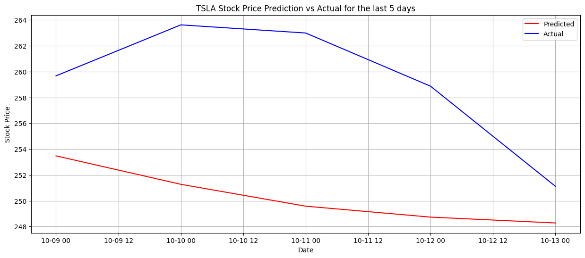

# Model Card

## Model Description

**Input:** Describe the inputs of your model. Historical stock price of a specific stock (3 months)

**Output:** Describe the output(s) of your model. Predicted stock price of a specific stock up to 5 days.

**Model Architecture:** Describe the model architecture you’ve used. An extension of Recurrent Neural Networks (RNN), Long Short Term Memory (LSTM) are used to model sequential and chronological data. Bayesian optimisation was used to fine-tuned 4 parameters: hidden layers, neurons, epoch and learning rate.

## Performance

Give a summary graph or metrics of how the model performs. Remember to include how you are measuring the performance and what data you analysed it on. 

1. Performance metric used to measure model is Mean Square Error (MSE). 

2. For Bayesian optimisation, absolute summation of differences from predicted and actual are used to find the global minima. 

## Limitations

Outline the limitations of your model.
1.	Inherently stochastic data: Stock prices are noisy by nature as data are driven by humans. Longer historical data used to train the model will result in a degradation of performance.
2.	Sensitivity Hyperparameters: Using Bayesian optimisation, it is possible to fine-tuned hyperparameter. Note that this approach is computationally expensive.

## Trade-offs

Outline any trade-offs of your model, such as any circumstances where the model exhibits performance issues. In deep learning applications, there's a general belief that having more data can improve model performance. This idea stems from the advantage of exposing the model to diverse examples, potentially enhancing its generalization capabilities. However, when it comes to stock market data, the situation might be more nuanced. Given the unpredictable and stochastic nature of stock prices, simply adding more historical data might not always enhance a model's predictive power. 
Furthermore, there's a notion in financial analysis that stocks with a high percentage of institutional ownership can exhibit more stability. Institutional investors, with their long-term investment strategies, might be less reactive to short-term market noise compared to individual or retail investors. However, there are exceptions and complexities, as evidenced by events like the GameStop (GME) price surge, where retail investor coordination had a pronounced impact on stock prices. 
