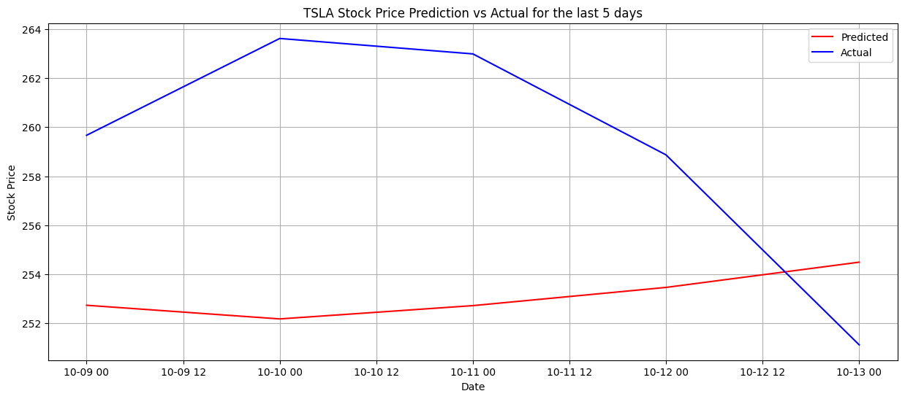

# Model Card

See the [example Google model cards](https://modelcards.withgoogle.com/model-reports) for inspiration. 

## Model Description

**Input:** Describe the inputs of your model. Historical stock price of a specific stock (3 months)

**Output:** Describe the output(s) of your model. Predicted stock price of a specific stock up to 5 days.

**Model Architecture:** Describe the model architecture you’ve used. An extension of Recurrent Neural Networks (RNN), Long Short Term Memory (LSTM) are used to model sequential and chronological data. Bayesian optimisation was used to fine-tuned 4 parameters: hidden layers, neurons, epoch and learning rate.

## Performance

Give a summary graph or metrics of how the model performs. Remember to include how you are measuring the performance and what data you analysed it on. Performance metric used to measure model is Mean Square Error (MSE). 
For Bayesian optimisation, absolute summation of differences from predicted and actual are used to find the global minima. 

## Limitations

Outline the limitations of your model.

## Trade-offs

Outline any trade-offs of your model, such as any circumstances where the model exhibits performance issues. 
